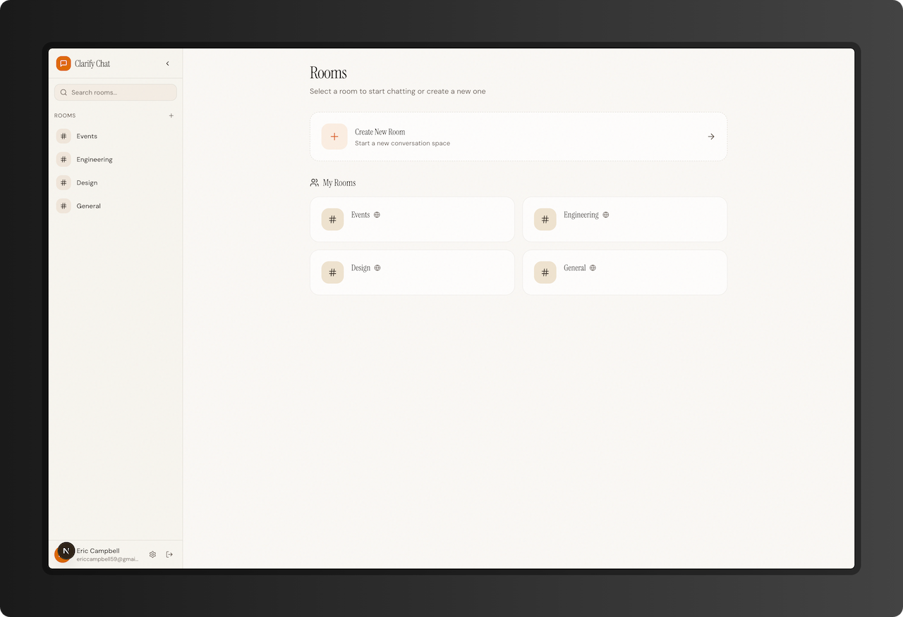
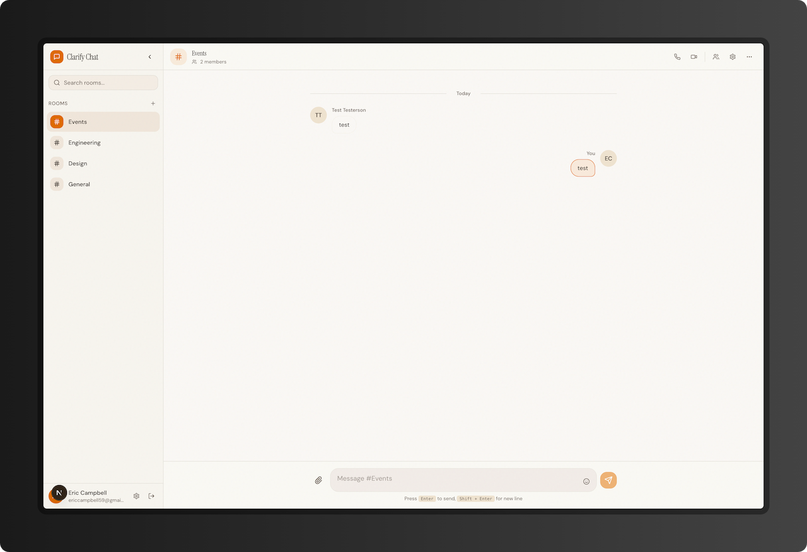
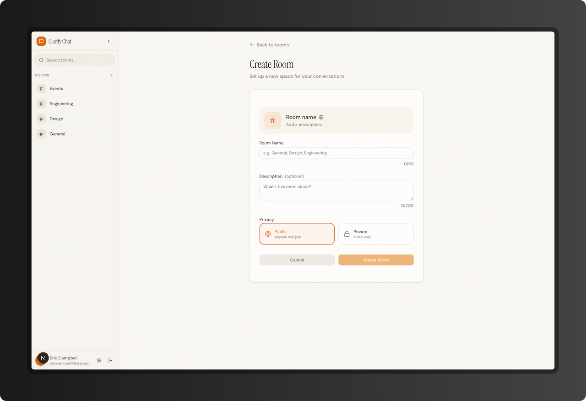
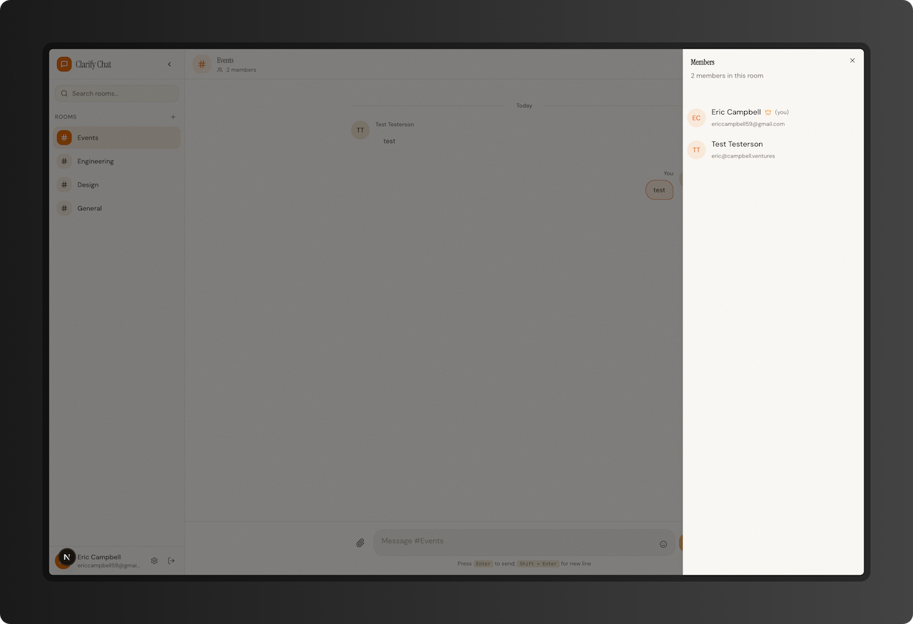
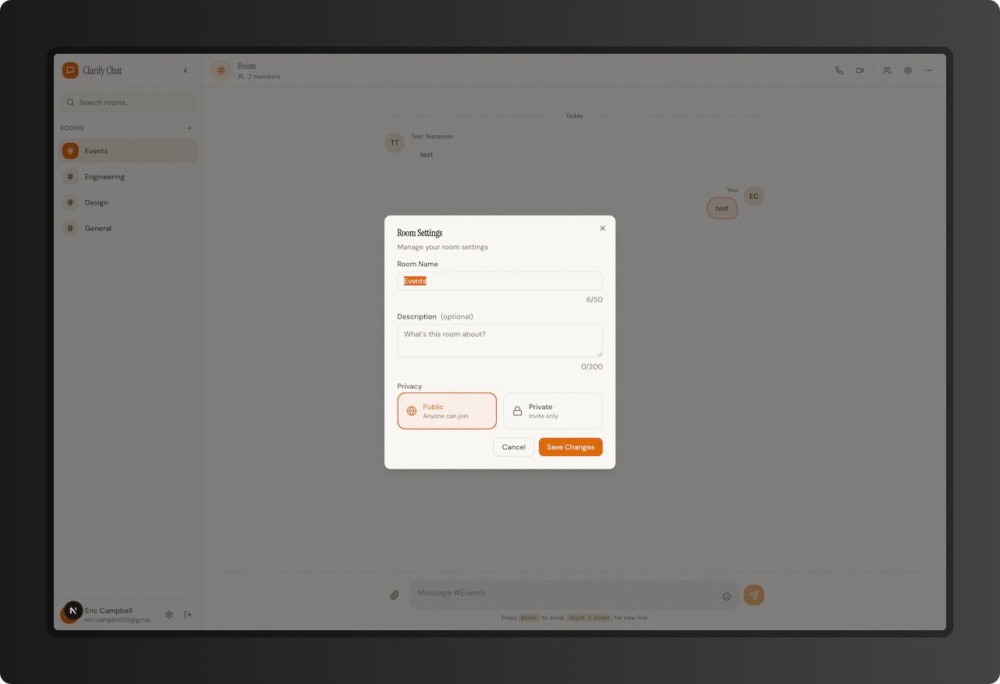

# Clarify Chat

A real-time chat application built with modern web technologies.

## Tech Stack

- **Runtime**: [Bun](https://bun.sh)
- **Monorepo**: [Turborepo](https://turbo.build)
- **Frontend**: [Next.js 15](https://nextjs.org) with React 19
- **Backend**: [Fastify](https://fastify.dev) with WebSocket support
- **API**: [tRPC](https://trpc.io) with real-time subscriptions
- **Database**: PostgreSQL with [Drizzle ORM](https://orm.drizzle.team)
- **Authentication**: [Better Auth](https://better-auth.com)
- **UI**: [Tailwind CSS](https://tailwindcss.com) + [shadcn/ui](https://ui.shadcn.com)

## Project Structure

```
clarify/
├── apps/
│   ├── api/          # Fastify API server with WebSocket support
│   └── web/          # Next.js frontend application
├── packages/
│   ├── api/          # tRPC routers and procedures
│   ├── auth/         # Authentication configuration (better-auth)
│   ├── db/           # Database schema and client (Drizzle + Postgres)
│   ├── logger/       # Shared logging utility
│   ├── ui/           # Shared UI components (shadcn/ui)
│   ├── eslint-config/
│   └── typescript-config/
```

## Features

- **Real-time Messaging**: Instant message delivery using WebSocket subscriptions
- **Room Management**: Create, join, and leave chat rooms
- **Public & Private Rooms**: Control room visibility and access
- **Member Management**: Room owners can manage members
- **Live Updates**: Real-time notifications for room changes and member activity

## Screenshots

### Rooms Overview


### Chat Room


### Create Room


### Room Members


### Room Settings


## Getting Started

### Prerequisites

- [Bun](https://bun.sh) v1.2+
- PostgreSQL 15+

### Setup

1. **Install dependencies**

   ```bash
   bun install
   ```

2. **Configure environment**

   Create a `.env` file in the root directory:

   ```env
   DATABASE_URL=postgresql://user@localhost:5432/clarify
   ```

3. **Create the database**

   ```bash
   createdb clarify
   ```

4. **Run migrations**

   ```bash
   cd packages/db && bun run db:migrate
   ```

5. **Start development servers**

   ```bash
   bun run dev
   ```

   This starts:
   - Web app at `http://localhost:3000`
   - API server at `http://localhost:3001`

## Scripts

| Command | Description |
|---------|-------------|
| `bun run dev` | Start all apps in development mode |
| `bun run build` | Build all apps and packages |
| `bun run check-types` | Type-check all packages |
| `bun run test` | Run API tests |
| `bun run lint` | Lint all packages |

## Database

Manage the database with Drizzle:

```bash
cd packages/db

# Generate migrations from schema changes
bun run db:generate

# Apply migrations
bun run db:migrate

# Open Drizzle Studio
bun run db:studio
```

## Testing

Tests run against a separate test database:

```bash
# Create test database
createdb clarify-tests

# Run migrations on test database
cd packages/db && bun run db:migrate:test

# Run tests
bun run test
```

## Adding UI Components

Add shadcn/ui components from the web app:

```bash
cd apps/web
pnpm dlx shadcn@latest add button
```

Components are placed in `packages/ui/src/components` and can be imported:

```tsx
import { Button } from "@workspace/ui/components/button"
```
